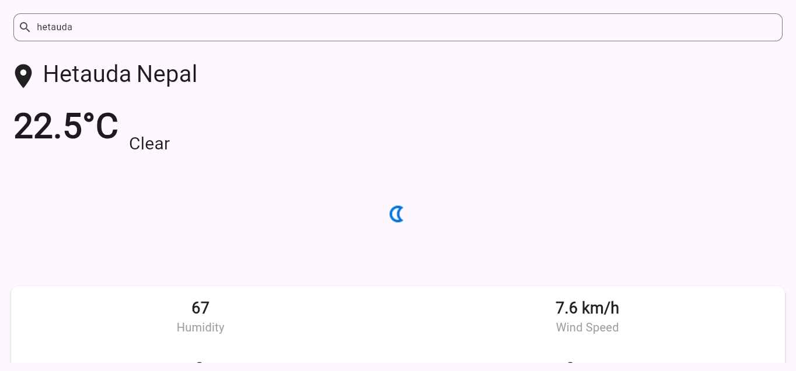

# Weather App

A simple and efficient Appication built by flutter with simple UI.


---

## Table of Contents

- [Features](#features)
- [Screenshots](#screenshots)
- [Tech Stack](#tech-stack)
- [Installation](#installation)
- [Usage](#usage)
- [Contributing](#contributing)

---

## Features

- **Weather Application**: User can search the name of city or place.
- **Attributes**: User can view different attributes regarding weather. 


---

## Screenshots

### Main Page


---

## Tech Stack

- **Frontend**: Flutter
- **Backend**: API

---

## Installation

### Prerequisites
- A modern web browser, mobile, windows.
### Steps

1. **Clone the Repository**

   ```bash
   git clone https://github.com/SaileshAcharya1229/weather_app
   cd Weather_app

2. **Open the Application**
Open the main.dart file and can select the device you want to run using vscode.


## Usage
1. **Search the place**: User can enter the place they want to know the weather about.

## Contributing
1. Fork the repository
2. Create a new branch (git checkout -b feature-name)
3. Commit changes (git commit -m "Add new feature")
4. Push to the branch (git push origin feature-name)
5. Open a Pull Request
